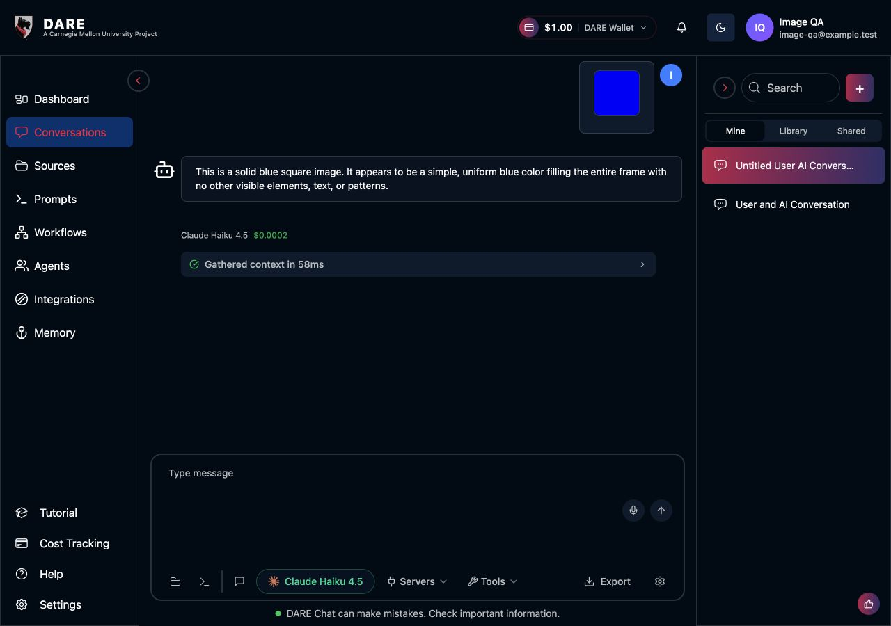
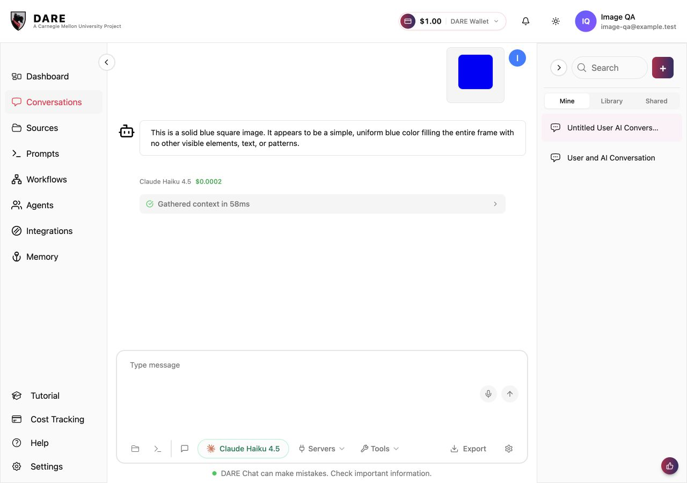
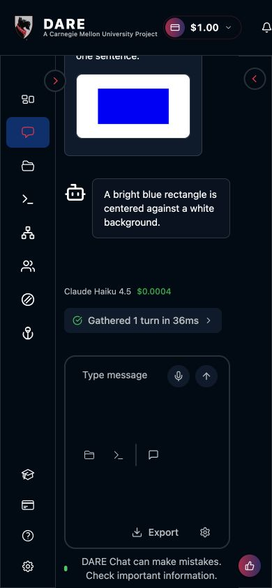
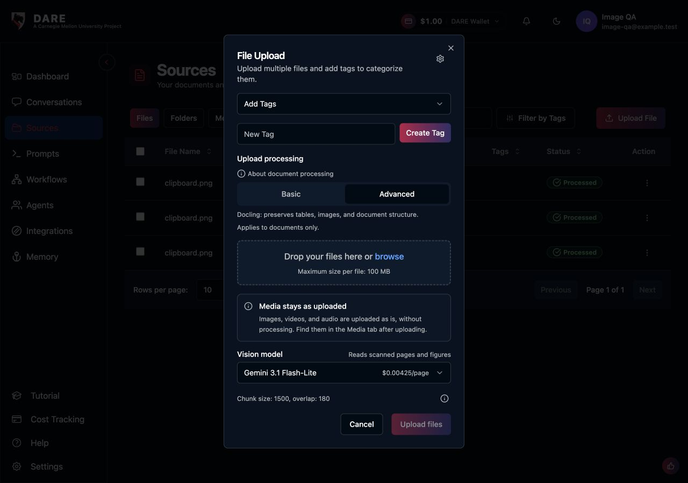

# Image-only chat verification

Verified locally on September 10, 2026, using an isolated PostgreSQL database,
a non-admin QA account, the real frontend and socket backend, and live Claude
Haiku 4.5 responses. No production conversations were used.

The original failure was reproduced through the browser: sending an image with
no text persisted the image, then failed with `ValueError: Message cannot be
empty` in `LLMQueryRequest`. REST history also returns absolute image URLs;
prepending the backend URL again broke reopened previews.

Verified after the frontend and companion backend fixes:

- Send a clipboard image with no prompt using Enter: Claude describes the image.
- Reopen the conversation with a full page reload: the saved image loads
  (`naturalWidth > 0`) and the saved response remains visible.
- Retry the originally failed image-only message after reopening: Claude
  describes the blue image, using its saved attachment.
- Follow up without attaching another image: Claude correctly answers “Blue.”
- Send a larger image with text: Claude describes the blue rectangle on white.
- At 390px viewport width, the 640px image fits the bubble at 162px wide.
- Check the reopened conversation in light and dark modes at desktop width.
- Upload through the file picker: the new image appears first, including in the
  Media tab. The explanatory note is visible before upload.

The browser exercised clipboard attachment, which shares the same composer
attachment/send path as drag-and-drop. A native file drag was not automated.

Frontend production build, full lint, touched-file lint and formatting pass.
Backend: nine new regression tests pass. A fresh full run completes 766 tests
with five failures in `core.test_rag_evidence_integrity.IndexReplacementTests`.
An untouched `dev` worktree reproduces the same five failures (757 tests), all
reporting closed database connections. Repository-wide backend formatting also
has existing failures; changed backend files pass Black and isort.

## Reopened chat

## Larger image on a narrow screen

## Upload explanation

