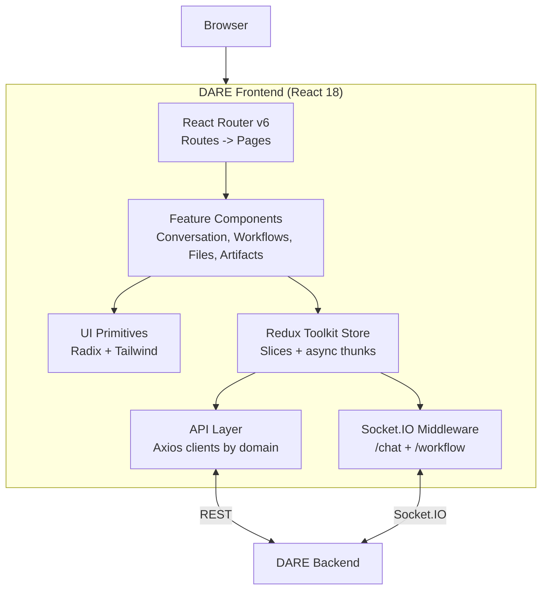

# DARE Frontend

React/TypeScript frontend for the **DARE (Dietrich Analysis Research Education Platform)**. Provides real-time chat with multiple LLM providers, file management with RAG, a visual workflow builder, and a prompt-template system.

## Purpose

The DARE frontend is the primary user interface for the DARE platform. It connects to the [DARE backend](../dare-backend/) over REST and Socket.IO and gives users:

- **Multi-LLM chat** — streaming conversations with OpenAI, Anthropic, Google, and self-hosted LLaMA models
- **File-grounded RAG** — upload documents and reference them in chat
- **Visual workflow builder** — design and run multi-step AI workflows as a DAG
- **Prompt templates** — reusable, parameterized prompts
- **Artifacts** — rich rendering for code, diagrams, and documents emitted by the model
- **MCP integration** — connect to Model Context Protocol servers for tool use

## Architecture Overview



See [docs/architecture.md](docs/architecture.md) for the full diagram and component breakdown.

## Quick Start (Local Development)

The frontend is a static SPA. For local development, use the Vite dev server. For production, build once and serve the generated `dist/` bundle from any static host.

```bash
# 1. Clone (or pull) the repo
git clone <repo-url> dare-frontend && cd dare-frontend

# 2. Install dependencies
npm install

# 3. Configure environment
cp .env.example .env
# Edit .env — point VITE_DJANGO_BACKEND_URL and VITE_WEBSOCKET_URL at your backend.
# Defaults assume backend on http://localhost:8000.

# 4. Run the dev server (Vite, port 5173)
npm run dev
```

Then open http://localhost:5173. The dev server hot-reloads on changes.

For a production build:

```bash
npm run build       # produces ./dist
npm run preview     # serves ./dist locally for verification
```

A minimal Docker recipe is in [INSTALL.md](INSTALL.md).

## Prerequisites

- Node.js 18+
- A running [DARE backend](../dare-backend/) (default `http://localhost:8000`)

## Available Scripts

| Command | Description |
|---|---|
| `npm run dev` | Start the Vite dev server on port 5173 |
| `npm run build` | Produce a production bundle in `dist/` |
| `npm run preview` | Serve the production bundle locally |
| `npm run lint` | Run ESLint over `src/` |
| `npm run format` | Run Prettier |

## Documentation

| Doc | What's in it |
|---|---|
| [INSTALL.md](INSTALL.md) | Full deployment guide — Docker and bare-metal static hosting |
| [docs/configuration.md](docs/configuration.md) | Every Vite environment variable, with type, default, and description |
| [docs/architecture.md](docs/architecture.md) | Component diagram, state management, Socket.IO integration |
| [docs/contributing.md](docs/contributing.md) | Issues, pull requests, coding standards |
| [docs/RULES.md](docs/RULES.md) | Project-specific conventions and constraints |
| [CHANGELOG.md](CHANGELOG.md) | Release notes |
| [SECURITY.md](SECURITY.md) | Vulnerability disclosure process |

## Project Structure

```
src/
├── api/                  # API layer (one file per domain)
├── components/           # UI components, organized by feature
│   ├── ui/               # Shadcn/ui primitives (Button, Dialog, etc.)
│   ├── Conversation/     # Chat interface
│   ├── WorkflowBuilder/  # Visual workflow editor
│   ├── FileManager/      # File upload and management
│   ├── Artifacts/        # Artifact rendering
│   └── Layout/           # App shell and navigation
├── config/               # Feature flags and runtime config
├── pages/                # Route-level pages
├── redux/
│   ├── slices/           # Redux state slices
│   ├── asyncThunks/      # createAsyncThunk wrappers per domain
│   ├── middleware/       # Socket.IO middleware (chat + workflow)
│   ├── types/            # TypeScript interfaces for API shapes
│   └── workflowBuilder/  # Workflow canvas state
├── routes/               # Route definitions and guards
├── schemas/              # Zod schemas for Socket.IO event validation
└── utils/                # Shared utilities
```

## Tech Stack

- **React 18** + **TypeScript**
- **Vite** for build and dev server
- **Redux Toolkit** for state management
- **React Router v6**
- **Tailwind CSS** + **Shadcn/ui** (Radix UI primitives)
- **Socket.IO Client** for real-time chat and workflow streaming
- **Formik + Yup** for forms
- **Zod** for runtime validation of Socket.IO events
- **Axios** for HTTP

## Related

- [dare-backend](../dare-backend/) — Django REST + Socket.IO backend
- [socraticbooks-backend](../socraticbooks-backend/) — Educational platform that proxies to DARE
- [socraticbooks-react](../socraticbooks-react/) — Educational platform frontend

## License

No open-source license has been selected in this repository yet. Add a `LICENSE` file before public release.
