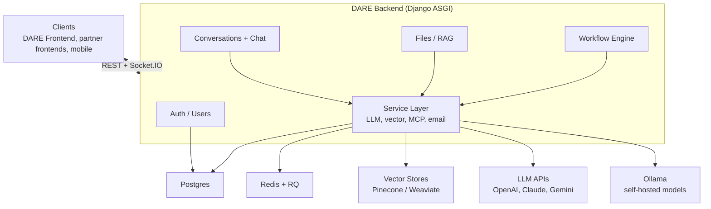

[](https://github.com/cmudco/dare-backend/blob/main/LICENSE)
[](https://www.python.org/)

> Django REST + Socket.IO backend for the **Dietrich Analysis Research Education (DARE) Platform**.

## Table of Contents

- [What is DARE?](#what-is-dare)
- [Overview](#overview)
- [Quick Start](#quick-start)
- [Documentation](#documentation)
- [Tech Stack](#tech-stack)
- [What is included in this repo?](#what-is-included-in-this-repo)
- [What is not included in this repo?](#what-is-not-included-in-this-repo)
- [Stay in touch](#stay-in-touch)
- [Acknowledgements](#acknowledgements)
- [Contributors](#contributors)
- [License](#license)

## What is DARE?

The Dietrich Analysis Research Education (DARE) Platform is an open-source, multi-LLM research and
conversation platform. It provides a single, vendor-agnostic interface to OpenAI, Anthropic Claude,
Google Gemini, and self-hosted LLaMA models, with file-grounded retrieval (RAG), Model Context
Protocol (MCP) tool integration, visual multi-step workflows, and real-time streaming. DARE is
built for researchers and institutions that need more than a chatbot — document intelligence,
reproducible workflows, and per-user usage tracking in one place.

**This repository is the DARE backend** — the Django ASGI service that powers the platform. It
handles:

- Real-time streaming chat across providers
- Document upload, processing, and RAG over vector stores (Pinecone, Weaviate)
- Multi-step AI workflow execution via a visual DAG builder
- Token usage tracking and per-user billing
- Access-code based registration for institutional deployments
- Inter-service authentication for partner platforms (e.g. SocraticBooks)

> **DARE runs standalone.** The DARE backend and frontend are all you need to run the platform —
> nothing else is required. SocraticBooks is a separate, optional platform built on top of DARE.

## Overview



See [docs/architecture.md](https://github.com/cmudco/dare-backend/blob/main/docs/architecture.md) for the full diagram and
[docs/architecture/overview.md](https://github.com/cmudco/dare-backend/blob/main/docs/architecture/overview.md) for component-level detail.

## Quick Start

Fastest path — Docker brings up the whole stack (API, worker, Postgres, Redis, Weaviate):

For local development, `scripts/dev-setup.sh --demo-user` does all of the below in one command
(submodule init, env files, build, demo login) — see [INSTALL.md](/docs/backend/install).

Document generation is powered by
[quillmark-mcp](https://github.com/tonguetoquill/quillmark-mcp) (Typst
rendering over MCP), vendored as the `quillmark-mcp/` git submodule and run as
a service in the compose stack.

```bash
# 1. Clone with the Quillmark submodule
git clone --recurse-submodules https://github.com/cmudco/dare-backend.git
cd dare-backend

# 2. Configure
cp .example.env .env      # set DJANGO_SECRET_KEY + one provider key (OPENAI_API_KEY / CLAUDE_API_KEY / GEMINI_API_KEY)

# 3. Build and start the backend stack
docker compose up --build -d
docker compose exec web python manage.py createsuperuser
docker compose exec web python manage.py collectstatic --noinput   # so the admin panel renders with its CSS/JS
curl http://localhost:8000/api/health/
```

The API is at `http://localhost:8000/`; Swagger UI at `/api/docs/`.

See **[QUICKSTART.md](https://github.com/cmudco/dare-backend/blob/main/QUICKSTART.md)** for the full walkthrough — the local-Python path,
collecting static files, and creating an access code so users can register — and
**[DEPLOYMENT.md](https://github.com/cmudco/dare-backend/blob/main/DEPLOYMENT.md)** for production and server deployment.

## Documentation

| Doc | What's in it |
| --- | --- |
| [QUICKSTART.md](https://github.com/cmudco/dare-backend/blob/main/QUICKSTART.md) | Run the backend locally — Docker stack, or local Python in a venv |
| [DEPLOYMENT.md](https://github.com/cmudco/dare-backend/blob/main/DEPLOYMENT.md) | Production deployment — Docker and bare metal |
| [docs/configuration.md](https://github.com/cmudco/dare-backend/blob/main/docs/configuration.md) | Every environment variable, with type, default, and description |
| [docs/architecture.md](https://github.com/cmudco/dare-backend/blob/main/docs/architecture.md) | Component diagram and request flows |
| [docs/admin-guide.md](https://github.com/cmudco/dare-backend/blob/main/docs/admin-guide.md) | User/role management, access codes, analytics |
| [CONTRIBUTING.md](https://github.com/cmudco/dare-backend/blob/main/CONTRIBUTING.md) | Issues, pull requests, coding standards |
| [CHANGELOG.md](https://github.com/cmudco/dare-backend/blob/main/CHANGELOG.md) | Release notes |
| [SECURITY.md](https://github.com/cmudco/dare-backend/blob/main/SECURITY.md) | Vulnerability disclosure process |
| [docs/integration/socraticbooks-dare-proxy.md](https://github.com/cmudco/dare-backend/blob/main/docs/integration/socraticbooks-dare-proxy.md) | DARE/SocraticBooks integration contract and update rules |
| [docs/architecture/socketio-events.md](https://github.com/cmudco/dare-backend/blob/main/docs/architecture/socketio-events.md) | Socket.IO event reference |
| [docs/api/dare-backend.md](https://github.com/cmudco/dare-backend/blob/main/docs/api/dare-backend.md) | REST API reference |
| [docs/code-standards.md](https://github.com/cmudco/dare-backend/blob/main/docs/code-standards.md) | Coding conventions |

## Tech Stack

- **Python 3.13**, Django 5.1, Django REST Framework
- **Django Channels** + python-socketio for real-time streaming
- **Django RQ** + Redis for background jobs
- **PostgreSQL** (production) / SQLite (local dev)
- **Weaviate** and **Pinecone** for vector storage
- **Ollama** for self-hosted LLaMA models

## What is included in this repo?

- Django apps for auth/users, conversations + chat, files/RAG, and the workflow engine
- `core/services/` — the service layer (LLM providers, vector stores, MCP, email)
- `docs/` — architecture, configuration, admin, API reference, deployment, and integration guides
- Docker Compose stack (API, RQ worker, Postgres + pgvector, Redis, Weaviate) and `requirements/`
- Supporting docs — `QUICKSTART.md`, `DEPLOYMENT.md`, `CONTRIBUTING.md`, `CHANGELOG.md`, `SECURITY.md`, `BRAND.md`

## What is not included in this repo?

- [dare-frontend](https://github.com/cmudco/dare-frontend) — the React/TypeScript web client (run it separately)
- [socraticbooks-backend](https://github.com/cmudco/socraticbooks-backend) and
  [socraticbooks-react](https://github.com/cmudco/socraticbooks-react) — the SocraticBooks platform that
  proxies to DARE
- External infrastructure you provide yourself — LLM provider API keys, an Ollama host for
  self-hosted models, and managed Postgres/Redis/vector-store instances in production

## Stay in touch

- **Found a bug or have a feature request?** Open an issue on the project's GitHub repository.
- **Questions or general inquiries?** Email the project team at vks@andrew.cmu.edu.
- **Security disclosures:** see [SECURITY.md](https://github.com/cmudco/dare-backend/blob/main/SECURITY.md).

## Acknowledgements

DARE is an Open Forum for AI (OFAI) initiative, Carnegie Mellon University Libraries.

The DARE name and marks are owned by Carnegie Mellon University. Use of the name, wordmark,
Scotty dog mark, header lockup, and footer badge is governed by the
[DARE Brand Guidelines & Usage Policy](https://github.com/cmudco/dare-backend/blob/main/BRAND.md), independently of the software license.

This software integrates with third-party APIs (Anthropic, OpenAI, Google, and others); use of those
APIs is subject to each provider's own Terms of Service.

## Contributors

DARE is built and maintained by contributors at Carnegie Mellon University and in the open-source community.

**Creators**

&lt;table&gt;
  &lt;tr&gt;
    &lt;td align="center" valign="top" width="33.33%"&gt;&lt;img src="https://ui-avatars.com/api/?name=Sayeed+Choudhury&size=100&background=162B4B&color=fff" width="100" height="100" style="border-radius:50%" alt="Sayeed Choudhury" /&gt;&lt;br /&gt;&lt;sub&gt;&lt;b&gt;Sayeed Choudhury&lt;/b&gt;&lt;/sub&gt;&lt;br /&gt;Creator&lt;/td&gt;
    &lt;td align="center" valign="top" width="33.33%"&gt;&lt;img src="https://raw.githubusercontent.com/cmudco/dare-backend/main/.github/assets/team/vince.png" width="100" height="100" style="border-radius:50%" alt="Vincent Sha" /&gt;&lt;br /&gt;&lt;sub&gt;&lt;b&gt;Vincent Sha&lt;/b&gt;&lt;/sub&gt;&lt;br /&gt;Creator&lt;/td&gt;
    &lt;td align="center" valign="top" width="33.33%"&gt;&lt;img src="https://raw.githubusercontent.com/cmudco/dare-backend/main/.github/assets/team/george.png" width="100" height="100" style="border-radius:50%" alt="George Cann" /&gt;&lt;br /&gt;&lt;sub&gt;&lt;b&gt;George Cann&lt;/b&gt;&lt;/sub&gt;&lt;br /&gt;Creator&lt;/td&gt;
  &lt;/tr&gt;
&lt;/table&gt;

**Team**

&lt;table&gt;
  &lt;tr&gt;
    &lt;td align="center" valign="top" width="33.33%"&gt;&lt;img src="https://raw.githubusercontent.com/cmudco/dare-backend/main/.github/assets/team/carl.png" width="100" height="100" style="border-radius:50%" alt="Carl Skipper" /&gt;&lt;br /&gt;&lt;sub&gt;&lt;b&gt;Carl Skipper&lt;/b&gt;&lt;/sub&gt;&lt;br /&gt;Contributor&lt;/td&gt;
    &lt;td align="center" valign="top" width="33.33%"&gt;&lt;img src="https://ui-avatars.com/api/?name=Muhammad+Abdurrehman&size=100&background=162B4B&color=fff" width="100" height="100" style="border-radius:50%" alt="Muhammad Abdurrehman" /&gt;&lt;br /&gt;&lt;sub&gt;&lt;b&gt;Muhammad Abdurrehman&lt;/b&gt;&lt;/sub&gt;&lt;br /&gt;Team Lead&lt;/td&gt;
    &lt;td align="center" valign="top" width="33.33%"&gt;&lt;img src="https://ui-avatars.com/api/?name=Brian+Wingenroth&size=100&background=162B4B&color=fff" width="100" height="100" style="border-radius:50%" alt="Brian Wingenroth" /&gt;&lt;br /&gt;&lt;sub&gt;&lt;b&gt;Brian Wingenroth&lt;/b&gt;&lt;/sub&gt;&lt;br /&gt;Developer&lt;/td&gt;
  &lt;/tr&gt;
  &lt;tr&gt;
    &lt;td align="center" valign="top" width="33.33%"&gt;&lt;img src="https://ui-avatars.com/api/?name=Farhat+Abbas&size=100&background=162B4B&color=fff" width="100" height="100" style="border-radius:50%" alt="Farhat Abbas" /&gt;&lt;br /&gt;&lt;sub&gt;&lt;b&gt;Farhat Abbas&lt;/b&gt;&lt;/sub&gt;&lt;br /&gt;Developer&lt;/td&gt;
    &lt;td align="center" valign="top" width="33.33%"&gt;&lt;img src="https://ui-avatars.com/api/?name=Hariss+M&size=100&background=162B4B&color=fff" width="100" height="100" style="border-radius:50%" alt="Hariss M." /&gt;&lt;br /&gt;&lt;sub&gt;&lt;b&gt;Hariss M.&lt;/b&gt;&lt;/sub&gt;&lt;br /&gt;Developer&lt;/td&gt;
    &lt;td align="center" valign="top" width="33.33%"&gt;&lt;img src="https://ui-avatars.com/api/?name=Eira+Khan&size=100&background=162B4B&color=fff" width="100" height="100" style="border-radius:50%" alt="Eira Khan" /&gt;&lt;br /&gt;&lt;sub&gt;&lt;b&gt;Eira Khan&lt;/b&gt;&lt;/sub&gt;&lt;br /&gt;QA&lt;/td&gt;
  &lt;/tr&gt;
&lt;/table&gt;

## License

This project is licensed under the [GNU Affero General Public License v3.0](https://github.com/cmudco/dare-backend/blob/main/LICENSE) (AGPL-3.0-only).
The software license does not grant rights to the DARE name or marks; see the
[DARE Brand Guidelines & Usage Policy](https://github.com/cmudco/dare-backend/blob/main/BRAND.md).

See the [LICENSE](https://github.com/cmudco/dare-backend/blob/main/LICENSE) file for the full license text, or visit &lt;https://www.gnu.org/licenses/agpl-3.0.en.html&gt;.
