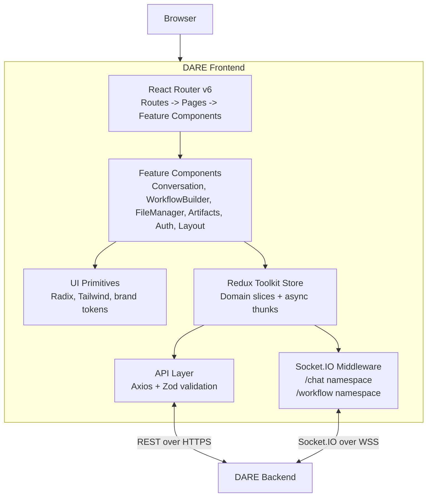

This document is the entry point for understanding how the frontend is structured. For the backend's view of the same system, see [dare-backend/docs/architecture.md](/docs/backend/architecture).

## Component Diagram



## State Management

Redux Toolkit organizes state by domain, with two Socket.IO middleware files for real-time channels:

```
src/redux/
├── slices/                          # State slices by domain
│   ├── userSlice.ts                 # Auth + preferences
│   ├── conversationSlice.ts         # Chat sessions and messages
│   ├── fileSlice.ts                 # Uploads and processing status
│   ├── workflowSlice.ts             # Workflow definitions and runs
│   ├── promptSlice.ts               # Prompt templates
│   ├── billingSlice.ts              # Token usage and cost
│   ├── tagsSlice.ts                 # File tags
│   ├── themeSlice.ts                # Light/dark mode
│   ├── notificationSlice.ts         # Toast notifications
│   └── websocketSlice.ts            # Connection state
├── asyncThunks/                     # createAsyncThunk wrappers, one file per domain
├── middleware/
│   ├── socketMiddleware.ts          # /chat namespace — chat, messages, artifacts, voice
│   └── workflowSocketMiddleware.ts  # /workflow namespace — execution, steps, batches
├── types/                           # TypeScript interfaces matching API response shapes
└── workflowBuilder/                 # Canvas state — nodes, edges, undo/redo
```

**Patterns:**

- All slices use `createSlice` with reducers.
- Async operations use `createAsyncThunk`, never inline `dispatch(fn)`.
- Type-safe hooks via `useSelector&lt;RootState&gt;` and `useDispatch&lt;AppDispatch&gt;`.
- Middleware owns Socket.IO lifecycle — connect, reconnect, dispatch on event.

## Socket.IO Integration

Two namespaces, two middleware files, one connection lifecycle each.

| Namespace | Middleware | Used by |
|---|---|---|
| `/chat` | `socketMiddleware.ts` | Streaming completions, artifact emission, message acks |
| `/workflow` | `workflowSocketMiddleware.ts` | DAG execution, per-step progress, batch run updates |

**Validation rule:** All incoming `/workflow` events are validated with Zod schemas in `src/schemas/workflowSocket.ts` before being dispatched to Redux. This catches backend-side schema drift early and surfaces a typed error instead of a silently broken UI.

For the full event contract — payload shapes, directions, error codes — see the backend's [Socket.IO event reference](/docs/backend/socketio-events).

## API Layer

```
src/api/                # One file per domain (auth, conversation, files, ...)
src/redux/types/        # TypeScript interfaces matching API response shapes
src/redux/asyncThunks/  # createAsyncThunk wrappers, one file per domain
```

Integration cycle:

```
Component → dispatch(thunk) → api/<domain>.ts → axios → Backend →
  thunk fulfilled → slice handles state → component re-renders
```

Centralized concerns:

- **Base URL & headers** in `src/api/config.ts`.
- **Token refresh** via axios response interceptor.
- **Error normalization** in `src/utils/errorHandler.ts` — extracts user-friendly messages from DRF error shapes.

## Component Organization

```
src/components/
├── ui/                # Shadcn/ui primitives (Button, Dialog, Input, ...) — reusable
├── Auth/              # Login, register, password reset
├── Conversation/      # Chat view, message list, composer
├── WorkflowBuilder/   # Canvas, nodes, edges, run controls
├── FileManager/       # Upload, list, tag, folder
├── Artifacts/         # Code blocks, diagrams, document previews
├── Dashboard/         # Analytics overview
└── Layout/            # App shell, sidebar, header
```

Feature folders follow the same internal layout: `index.tsx`, sub-components, hooks (`useX.ts`), and feature-specific types co-located.

## Routing

```ts
<Route path="/login" element={<LoginScreen />} />
<Route path="/dashboard" element={
  <ProtectedRoute>
    <Dashboard />
  </ProtectedRoute>
} />
```

`ProtectedRoute` checks the auth slice and redirects to `/login` if no valid token. A route listener (`src/routes/RouteListener.tsx`) handles cross-cutting concerns like analytics and toast cleanup on navigation.

## Styling

- **Tailwind** as the base utility system.
- **Shadcn/ui** for accessible component primitives, customized via Tailwind tokens.
- **CSS custom properties** drive light/dark theming — toggling adds/removes the `dark` class on `&lt;html&gt;`.
- Brand colors and the DARE gradient live in `tailwind.config.ts`.
- Class merging via the `cn()` helper (`clsx` + `tailwind-merge`).

## Forms

Formik + Yup for non-trivial forms. Validation schemas are defined alongside the form component and shared with the backend's serializer-level validation where useful. Simple inputs use plain controlled state.

## TypeScript

- Strict mode on.
- Interfaces preferred over type aliases for object shapes.
- API response types in `src/redux/types/` are the source of truth for shape — update them when the backend changes.

## Performance

- Route-level code splitting (`React.lazy` + `Suspense`).
- `useMemo` / `useCallback` for expensive renders or stable references passed to memoized children.
- Virtualization (`react-virtual` or similar) for long lists where applicable.
- Vite's default asset fingerprinting + immutable cache headers in production (see [INSTALL.md](/docs/frontend/install)).

## Build & Bundle

- **Vite** for dev server and production builds.
- **Path alias** `@/` → `src/`.
- **Source maps** uploaded to Sentry during CI builds when Sentry envs are set.

## Further reading

- [docs/configuration.md](/docs/frontend/configuration) — Vite environment variables
- [docs/contributing.md](/docs/frontend/contributing) — coding standards and PR process
- [docs/RULES.md](/docs/frontend/rules) — project-specific conventions
- [dare-backend/docs/architecture/socketio-events.md](/docs/backend/socketio-events) — full event contract
