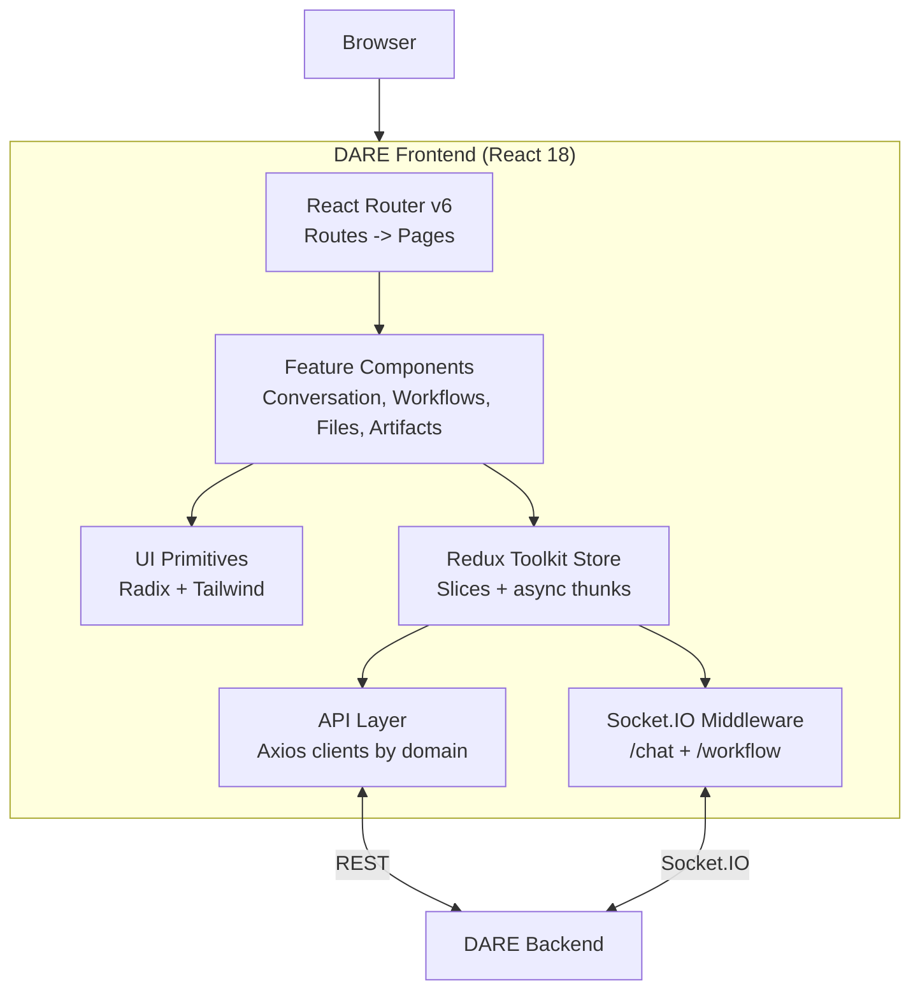

[](/docs/reference/license)
[](https://nodejs.org/)

> React/TypeScript frontend for **DARE** — the Dietrich Analysis Research Education Platform.

## Table of Contents

- [What is DARE?](#what-is-dare)
- [Screenshots](#screenshots)
- [Overview](#overview)
- [Quick Start](#quick-start)
- [Documentation](#documentation)
- [Tech Stack](#tech-stack)
- [What is included in this repo?](#what-is-included-in-this-repo)
- [What is not included in this repo?](#what-is-not-included-in-this-repo)
- [Stay in touch](#stay-in-touch)
- [Acknowledgements](#acknowledgements)
- [Contributors](#contributors)
- [License](#license)

## What is DARE?

DARE (Dietrich Analysis Research Education Platform) is an open-source, multi-LLM research and
conversation platform. It provides a single, vendor-agnostic interface to OpenAI, Anthropic Claude,
Google Gemini, and self-hosted LLaMA models, with file-grounded retrieval (RAG), Model Context
Protocol (MCP) tool integration, visual multi-step workflows, and real-time streaming. DARE is
built for researchers and institutions that need more than a chatbot — document intelligence,
reproducible workflows, and per-user usage tracking in one place.

**This repository is the DARE web frontend** — the primary user interface for the platform. It
connects to the `DARE backend` over REST and Socket.IO and gives users:

- **Multi-LLM chat** — streaming conversations with OpenAI, Anthropic, Google, and self-hosted LLaMA models
- **File-grounded RAG** — upload documents and reference them in chat
- **Visual workflow builder** — design and run multi-step AI workflows as a DAG
- **Prompt templates** — reusable, parameterized prompts
- **Artifacts** — rich rendering for code, diagrams, and documents emitted by the model
- **MCP integration** — connect to Model Context Protocol servers for tool use

> **DARE runs standalone.** The DARE frontend and backend are all you need to run the platform —
> nothing else is required. SocraticBooks is a separate, optional platform built on top of DARE.

## Screenshots

**Environmental impact dashboard** — every message is metered for energy, carbon, and water, with
per-model breakdowns and real-world equivalents:

&lt;p align="center"&gt;
  &lt;img src="public/screenshots/environmental-usage.png" alt="Environmental impact dashboard — energy, carbon, and water usage with real-world equivalents and per-model energy consumption" width="900" /&gt;
&lt;/p&gt;

|                                                                                                                             |                                                                                                                            |
| :-------------------------------------------------------------------------------------------------------------------------: | :------------------------------------------------------------------------------------------------------------------------: |
| **Multi-LLM chat** — streaming conversations with per-conversation tools and controls&lt;br/&gt;&lt;img src="public/screenshots/conversation.png" alt="Conversation view with configuration panel" width="440" /&gt; | **Workflow builder** — multi-step pipelines with conditional routing and human validation&lt;br/&gt;&lt;img src="public/screenshots/workflows.png" alt="Visual workflow builder canvas" width="440" /&gt; |
| **Research mode** — agent-gathered sources, human-reviewed before becoming knowledge&lt;br/&gt;&lt;img src="public/screenshots/research-mode.png" alt="Research workspace with review pipeline" width="440" /&gt; | **Cost tracking** — a wallet per user, a ledger per message&lt;br/&gt;&lt;img src="public/screenshots/cost-wallet.png" alt="Cost tracking with wallet balance and transaction history" width="440" /&gt; |
| **Files & RAG** — upload and tag a corpus, ground answers in it&lt;br/&gt;&lt;img src="public/screenshots/files.png" alt="File manager with processing status" width="440" /&gt; | **Usage dashboard** — activity, tokens, and spend at a glance&lt;br/&gt;&lt;img src="public/screenshots/dashboard.png" alt="Usage dashboard with activity statistics" width="440" /&gt; |

## Overview



The frontend is a static single-page app: a Redux Toolkit store drives feature components, an Axios
API layer talks REST to the backend, and Socket.IO middleware streams chat and workflow events. See
[docs/architecture.md](/docs/frontend/architecture) for the full diagram and component breakdown.

## Quick Start

The frontend is a static SPA. For local development, use the Vite dev server. For production, build
once and serve the generated `dist/` bundle from any static host.

**Prerequisites:** Node.js 18+ and a running `DARE backend` (default `http://localhost:8000`).

```bash
# 1. Clone (or pull) the repo
git clone <repo-url> dare-frontend && cd dare-frontend

# 2. Install dependencies
npm install

# 3. Configure environment
cp .env.example .env
# Edit .env — point VITE_DJANGO_BACKEND_URL and VITE_WEBSOCKET_URL at your backend.
# Defaults assume backend on http://localhost:8000.

# 4. Run the dev server (Vite, port 5173)
npm run dev
```

Then open http://localhost:5173. The dev server hot-reloads on changes.

For a production build:

```bash
npm run build       # produces ./dist
npm run preview     # serves ./dist locally for verification
```

A minimal Docker recipe is in [INSTALL.md](/docs/frontend/install).

### Available scripts

| Command           | Description                            |
| ----------------- | -------------------------------------- |
| `npm run dev`     | Start the Vite dev server on port 5173 |
| `npm run build`   | Produce a production bundle in `dist/` |
| `npm run preview` | Serve the production bundle locally    |
| `npm run lint`    | Run ESLint over `src/`                 |
| `npm run format`  | Run Prettier                           |

## Documentation

| Doc                                            | What's in it                                                         |
| ---------------------------------------------- | -------------------------------------------------------------------- |
| [INSTALL.md](/docs/frontend/install)                       | Full deployment guide — Docker and bare-metal static hosting         |
| [docs/configuration.md](/docs/frontend/configuration) | Every Vite environment variable, with type, default, and description |
| [docs/architecture.md](/docs/frontend/architecture)   | Component diagram, state management, Socket.IO integration           |
| [CONTRIBUTING.md](/docs/frontend/contributing)             | Issues, pull requests, coding standards                              |
| [docs/RULES.md](/docs/frontend/rules)                 | Project-specific conventions and constraints                         |
| [CHANGELOG.md](/docs/reference/changelog)                   | Release notes                                                        |
| [SECURITY.md](/docs/reference/security)                     | Vulnerability disclosure process                                     |

## Tech Stack

- **React 18** + **TypeScript**
- **Vite** for build and dev server
- **Redux Toolkit** for state management
- **React Router v6**
- **Tailwind CSS** + **Shadcn/ui** (Radix UI primitives)
- **Socket.IO Client** for real-time chat and workflow streaming
- **Formik + Yup** for forms
- **Zod** for runtime validation of Socket.IO events
- **Axios** for HTTP

## What is included in this repo?

- `src/` — all application source code:
  - `api/` — API layer (one file per domain)
  - `components/` — UI components by feature (`Conversation/`, `WorkflowBuilder/`, `FileManager/`, `Artifacts/`, `Layout/`, and `ui/` primitives)
  - `redux/` — store, slices, async thunks, Socket.IO middleware, types, and workflow-canvas state
  - `pages/`, `routes/`, `schemas/` (Zod), `config/`, and `utils/`
- `docs/` — architecture, configuration, and project rules
- Supporting docs — `INSTALL.md`, `CONTRIBUTING.md`, `CHANGELOG.md`, `SECURITY.md`

## What is not included in this repo?

- `dare-backend` — the Django REST + Socket.IO backend this frontend depends on (run it separately)
- `socraticbooks-react` — the SocraticBooks frontend
- `socraticbooks-backend` — the SocraticBooks backend that proxies to DARE

## Stay in touch

- **Found a bug or have a feature request?** Open an issue on the project's GitHub repository.
- **Questions or general inquiries?** Email the project team at vks@andrew.cmu.edu.
- **Security disclosures:** see [SECURITY.md](/docs/reference/security).

## Acknowledgements

DARE is developed at the Dietrich College of Humanities and Social Sciences, Carnegie Mellon University.

"DARE" (Dietrich Analysis Research Education Platform) and "SocraticBots" are trademarks of Carnegie
Mellon University. For trademark, licensing, or general inquiries, contact the project team at
vks@andrew.cmu.edu.

This software integrates with third-party APIs (Anthropic, OpenAI, Google, and others); use of those
APIs is subject to each provider's own Terms of Service.

## Contributors

DARE is built and maintained by the team at the Dietrich College of Humanities and Social Sciences,
Carnegie Mellon University.

**Creators**

&lt;table&gt;
  &lt;tr&gt;
    &lt;td align="center" valign="top" width="33.33%"&gt;&lt;img src="https://ui-avatars.com/api/?name=Sayeed+Choudhury&size=100&background=162B4B&color=fff" width="100" height="100" style="border-radius:50%" alt="Sayeed Choudhury" /&gt;&lt;br /&gt;&lt;sub&gt;&lt;b&gt;Sayeed Choudhury&lt;/b&gt;&lt;/sub&gt;&lt;br /&gt;Creator&lt;/td&gt;
    &lt;td align="center" valign="top" width="33.33%"&gt;&lt;img src=".github/assets/team/vince.png" width="100" height="100" style="border-radius:50%" alt="Vincent Sha" /&gt;&lt;br /&gt;&lt;sub&gt;&lt;b&gt;Vincent Sha&lt;/b&gt;&lt;/sub&gt;&lt;br /&gt;Creator&lt;/td&gt;
    &lt;td align="center" valign="top" width="33.33%"&gt;&lt;img src=".github/assets/team/george.png" width="100" height="100" style="border-radius:50%" alt="George Cann" /&gt;&lt;br /&gt;&lt;sub&gt;&lt;b&gt;George Cann&lt;/b&gt;&lt;/sub&gt;&lt;br /&gt;Creator&lt;/td&gt;
  &lt;/tr&gt;
&lt;/table&gt;

**Team**

&lt;table&gt;
  &lt;tr&gt;
    &lt;td align="center" valign="top" width="33.33%"&gt;&lt;img src=".github/assets/team/carl.png" width="100" height="100" style="border-radius:50%" alt="Carl Skipper" /&gt;&lt;br /&gt;&lt;sub&gt;&lt;b&gt;Carl Skipper&lt;/b&gt;&lt;/sub&gt;&lt;br /&gt;Contributor&lt;/td&gt;
    &lt;td align="center" valign="top" width="33.33%"&gt;&lt;img src="https://ui-avatars.com/api/?name=Muhammad+Abdurrehman&size=100&background=162B4B&color=fff" width="100" height="100" style="border-radius:50%" alt="Muhammad Abdurrehman" /&gt;&lt;br /&gt;&lt;sub&gt;&lt;b&gt;Muhammad Abdurrehman&lt;/b&gt;&lt;/sub&gt;&lt;br /&gt;Team Lead&lt;/td&gt;
    &lt;td align="center" valign="top" width="33.33%"&gt;&lt;img src="https://ui-avatars.com/api/?name=Brian+Wingenroth&size=100&background=162B4B&color=fff" width="100" height="100" style="border-radius:50%" alt="Brian Wingenroth" /&gt;&lt;br /&gt;&lt;sub&gt;&lt;b&gt;Brian Wingenroth&lt;/b&gt;&lt;/sub&gt;&lt;br /&gt;Developer&lt;/td&gt;
  &lt;/tr&gt;
  &lt;tr&gt;
    &lt;td align="center" valign="top" width="33.33%"&gt;&lt;img src="https://ui-avatars.com/api/?name=Farhat+Abbas&size=100&background=162B4B&color=fff" width="100" height="100" style="border-radius:50%" alt="Farhat Abbas" /&gt;&lt;br /&gt;&lt;sub&gt;&lt;b&gt;Farhat Abbas&lt;/b&gt;&lt;/sub&gt;&lt;br /&gt;Developer&lt;/td&gt;
    &lt;td align="center" valign="top" width="33.33%"&gt;&lt;img src="https://ui-avatars.com/api/?name=Hariss+M&size=100&background=162B4B&color=fff" width="100" height="100" style="border-radius:50%" alt="Hariss M." /&gt;&lt;br /&gt;&lt;sub&gt;&lt;b&gt;Hariss M.&lt;/b&gt;&lt;/sub&gt;&lt;br /&gt;Developer&lt;/td&gt;
    &lt;td align="center" valign="top" width="33.33%"&gt;&lt;img src="https://ui-avatars.com/api/?name=Eira+Khan&size=100&background=162B4B&color=fff" width="100" height="100" style="border-radius:50%" alt="Eira Khan" /&gt;&lt;br /&gt;&lt;sub&gt;&lt;b&gt;Eira Khan&lt;/b&gt;&lt;/sub&gt;&lt;br /&gt;QA&lt;/td&gt;
  &lt;/tr&gt;
&lt;/table&gt;

## License

This project is licensed under the [GNU Affero General Public License v3.0](/docs/reference/license) (AGPL-3.0-only).

See the [LICENSE](/docs/reference/license) file for the full license text, or visit &lt;https://www.gnu.org/licenses/agpl-3.0.en.html&gt;.
